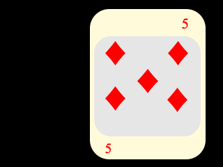

# Robótica Computacional 2020

[Mais orientações no README](./README.md)

## Prova SUB

**Você deve escolher somente 3 questões para fazer. Todo mundo que fizer pelo menos uma questão ganha 0.1**

Nome:_______________

Questões que fez:____________

Observações de avaliações nesta disciplina:

* Tenha os repositórios https://github.com/Insper/robot20/ e https://github.com/arnaldojr/my_simulation atualizados em seu catkin_ws/src .
* Você pode consultar a internet ou qualquer material, mas não pode se comunicar com pessoas ou colegas a respeito da prova
* Ponha o nome no enunciado da prova no Github
* Faça commits e pushes frequentes no seu repositório (tem dicas [no final deste arquivo](./inst
rucoes_setup.md))
* Esteja conectado no Teams e pronto para receber calls do professor e da equipe. 
* Se precisar se ausentar temporariamente, avise no chat da prova
* Permite-se consultar qualquer material online ou próprio. Não se pode compartilhar informações com colegas durante a prova
* Faça commits frequentes. O primeiro a enviar alguma ideia será considerado autor original
* A responsabilidade por ter o *setup* funcionando é de cada estudante
* Questões de esclarecimento geral podem ser perguntadas no chat do Teams
* Se você estiver em casa pode falar com seus familiares, mas não pode receber ajuda na prova.
* É vedado colaborar ou pedir ajuda a colegas ou qualquer pessoa que conheça os assuntos avaliados nesta prova.

Existe algumas dicas de referência rápida de setup [instrucoes_setup.md](instrucoes_setup.md)

**Integridade Intelectual**

Se você tiver alguma evidência de fraude cometida nesta prova, [use este serviço de e-mail anônimo](https://www.guerrillamail.com/pt/compose)  para informar ao professor.  Ou [este formulário](https://forms.gle/JPhqjPmuKAHxmvwZ9)

# Setup 

Veja instruções sobre como baixar os vídeos necessários. 

# Questões

## Questão 1  (3.3 pontos)

Você deve fazer um programa que, a cada momento, indica se a estrela azul está dentro ou fora do seu triângulo designado.

#### O que você deve fazer:

Se o penúltimo dígito de seu RA for ímpar, você deve considerar o triângulo vermelho

Se o penúltimo dígito seu RA for par, você deve considerar o triângulo verde'

#### Orientações

A função `triutil.point_in_triangle()` é fornecida pronta e verifica se um ponto está contido num triângulo ou não. Analise e execute o programa `tritest.py` para saber como ela funciona

Você vai notar que este programa roda o vídeo `triangulos.mp4`. 

Trabalhe no arquivo `q1/q1.py`. Este exercício **não precisa** de ROS

#### O que você deve fazer:

Mostrar na tela a string "Dentro" sempre que a estrela estiver dentro de seu triângulo designado.

Mostrar na tela a string "Fora" se a estrela estiver fora. 

Caso a estrela esteja na borda do triângulo, e parte esteja fora e outra parte esteja dentro,  você pode dar qualquer um dos dois resultados. 

Note que você vai precisar **descobrir** quais são os vértices do triângulo para poder chamar a função `triutil.point_in_triangle()`.  
 
Você também vai precisar selecionar um ou mais pontos para resumirem a estrela. Por exemplo, o centro de massa ou o centro do contorno. Pode ainda usar todos os pontos que pertencem à estrela e tentar achar um consenso. Enfim, fica a seu critério.

|Resultado| Conceito| 
|---|---|
| Não executa | 0 |
| Segmenta e limiariza seu triângulo | 0.75|
| Encontra vértices do triângulo  | 1.5 |
| Consegue segmentar a estrela e calcular que pontos testar| 2.3 |
| Imprime sempre corretamente  | 3.33 | 

Casos intermediários ou omissos da rubrica serão decididos pelo professor.

## Questão 2 (3.3 pontos)

Você vai começar a fazer um programa capaz de dizer qual carta de um baralho está sendo apresentada.

Seu objetivo é apontar o valor (ex.: "6")  e o naipe da carta appresentada a cada frame (ex.: Ouros)

#### Orientações

A análise precisa levar em conta a imagem. Não pode levar em conta somente os tempos.

Você vai precisar do arquivo `cartas.mp4` para resolver a questão.

Todas as cartas com naipes vermelhos são de ouros

Todas as cartas com naipes pretos são de paus

Baixe os arquivos de vídeo [neste link](https://github.com/Insper/robot20/raw/master/media/cartas.mp4)

#### O que você deve fazer:

Seu programa deve analisar a imagem e produzir uma saída indicando qual o naipe e qual o número. Ex.: `5 DE PAUS`, `6 DE OUROS` , etc. Seu programa só precisa funcionar para este vídeo específico, não será testado com outros vídeos em que apareçam cartas em outras posições.

O apontamento não precisa ser feito na tela, pode ser feito no terminal.

|Resultado| Conceito| 
|---|---|
| Não executa | 0 |
| Faz separação por cores dos marcadores de naipes  | 1.0 |
| Procura separar cada uma das regiões de paus ou ouros para contar quantas são, mas não acerta  | 2.3 |
| Funciona perfeitamente | 3.33 | 

Casos intermediários ou omissos da rubrica serão decididos pelo professor.

[Fonte dos arquivos](https://commons.wikimedia.org/wiki/File:Anglo-American_card_suits.svg)

## Questão 3  (3.3 pontos)

Vamos nos basear num arquivo que tinha sido fornecido par ao projeto 1.

A ideia é receber a informação que é passada pelo *id tag* Alvar e usá-la para tomar uma decisão. 

#### O que é para fazer

A partir da informação do tópico `ar_pose_marker` faça o robô parar a $1.60m$ de distância em seu próprio eixo $x$ do *creeper* azul código 11.  

O eixo $x$ local do robô é aquele que aponta sempre para a frente.

#### Como executar

Para executar, recomendamos que faça: 

    roslaunch my_simulation proj1_mult_estreita.launch

Depois precisamos do Rviz para ativar a atualização de sistemas de coordenadas:

roslaunch my_simulation rviz.launch

Depois:

    rosrun sub20 Q3_transformacoes_id.py

**Cuidado com teleops esquecidos** 

Dica: [Este documento auxiliar do projeto 1 pode ajudar](https://github.com/Insper/robot20/blob/master/projeto1/transformacoes.md)

|Resultado| Conceito| 
|---|---|
| Não executa | 0 |
| Consegue extrair a distância do marcador 11 na direção x do robô| 1.5|
| Para o robô a exatos 1.6 m do creeper (contando só eixo x) | 3.33 |

Casos intermediários ou omissos da rubrica serão decididos pelo professor.

## Questão 4 (3.3 pontos)

Você recebeu um código já pronto que aplica transformada de Hough para localizar as esferas azuis e verdes. Lembremos que estas esferas aparecem como círculos na visão frontal.

Para trocar de azul para verde por favor altere a string chamada `goal`.

O código também usa a leitura do laser para construir uma imagem que emula uma vista de cima. Esta é a janela chamada `LIDAR` nos arquivos.

#### O que é para fazer

Faça o robô chegar a $1.0 m$ perto do  cilindro **vermelho** e parar. Você deve usar para tal uma combinação de *laser* e câmera.  

**Pode ser necessário**  usar a imagem criada a partir do LIDAR para saber qual é o cilindro.

Você vai precisar adaptar a infraestrutura fornecida para filtrar vermelho.

#### Detalhes de como rodar

O código para este exercício está em: `p2_20/scripts/Q4_formas.py`

Para rodar, recomendamos que faça:

    roslaunch my_simulation formas.launch

Depois:

    rosrun sub20 Q4_formas.py

|Resultado| Conceito| 
|---|---|
| Não executa | 0 |
| Consegue filtrar o vermelho | 1.0 |
| Identifica qual o cilindro correto | 2.0 |
| Faz a abordagem baseada em câmera e laser para se aproximar corretamente e para na distância recomendada| 3.33 | 

Casos intermediários ou omissos da rubrica serão decididos pelo professor.

